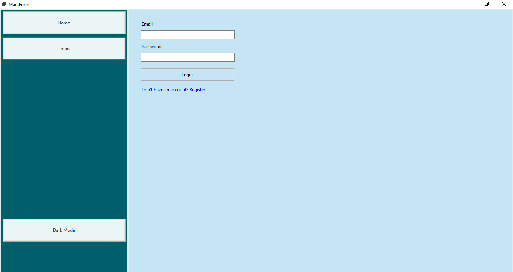
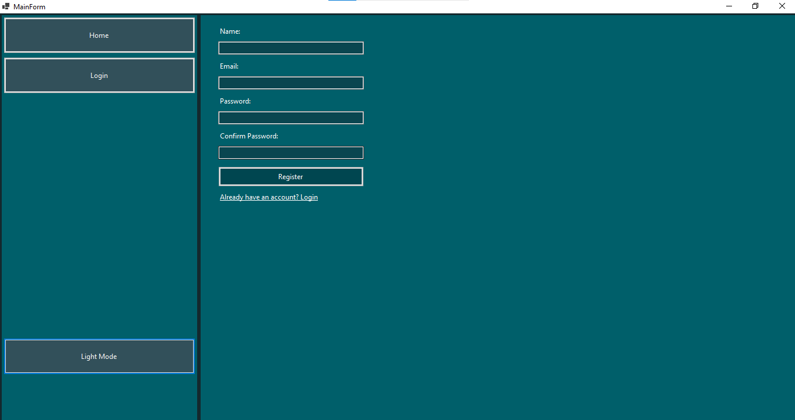
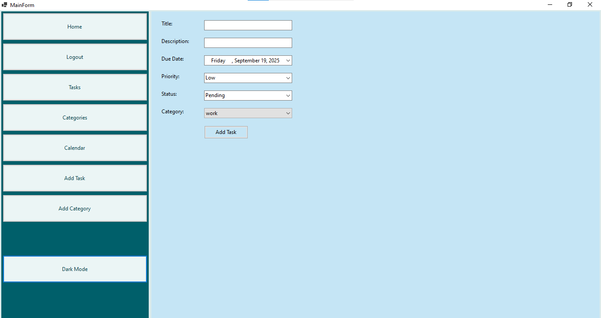
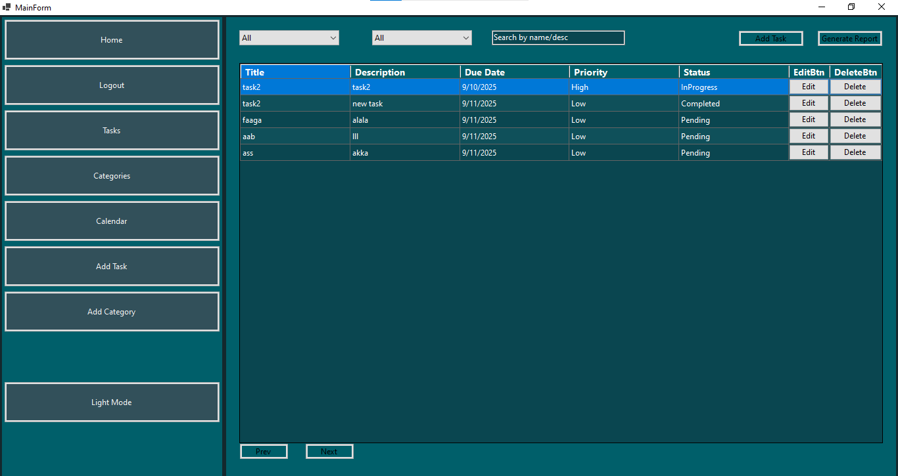
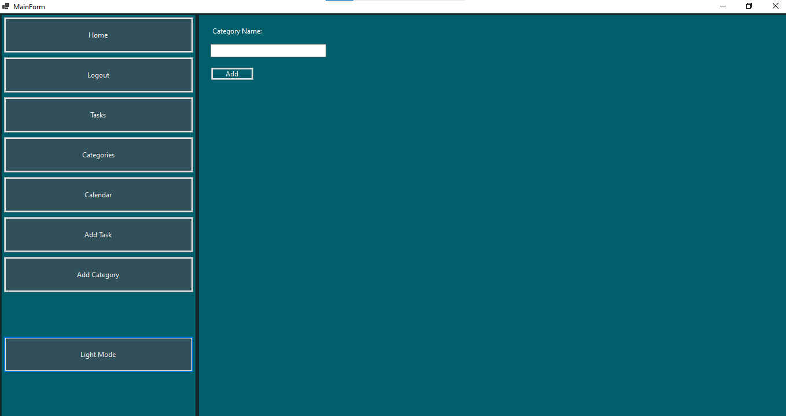
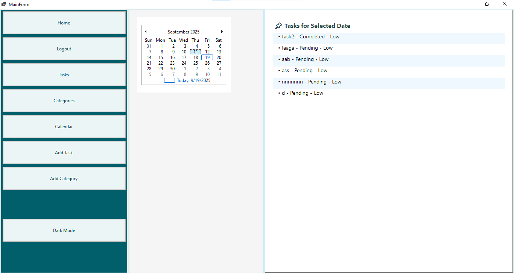

# Task Management Application

A desktop-based Task Management Application built with **C# .NET (Windows Forms)** and **Entity Framework (Code First)**.  
This project was developed as part of the **ITI training program** to practice backend development and database integration.

---

## 🚀 Features

- ➕ Add, ✏️ Update, and ❌ Delete tasks  
- 📂 Organize tasks into categories  
- 🔍 Filter tasks by status (Pending / In Progress / Completed)  
- 📊 Sort tasks by due date and group tasks by priority  
- 🔎 Search tasks by title/description  
- 📑 Pagination (e.g., 5 tasks per page)  
- 🌙 Dark Mode support  
- ⚠️ Confirmation alerts before deleting tasks  
- 📌 Dashboard with task distribution by status  
- 📈 Reports for tasks (Completed vs Pending)  
- 📅 Calendar view to visualize tasks by their due dates  

---

## 🛠️ Tech Stack

- **C# .NET (Windows Forms)**
- **Entity Framework (Code First)**
- **SQL Server**
- **LINQ**

---

## 📸 Screenshots

### Authentication

  
  

### Tasks

  
  

### Categories & Calendar

  
  

